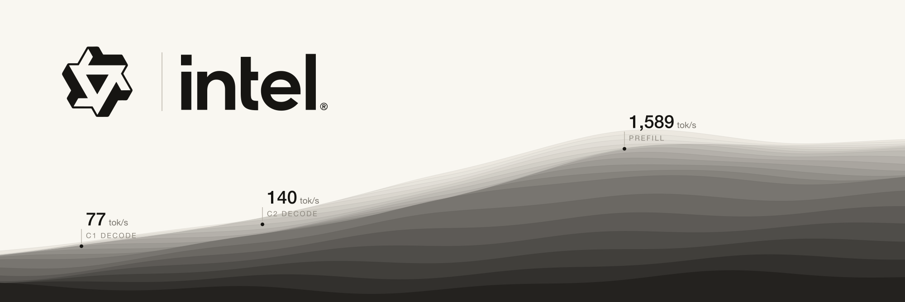

# exl3xpu



EXL3 ([exllamav3](https://github.com/turboderp-org/exllamav3) trellis quantization) inference on Intel Arc
Battlemage GPUs, as a vLLM plugin. Native ESIMD kernels decode the trellis bit-exactly and run the GEMMs
on the Xe2 vector and XMX units; vLLM supplies scheduling, paged KV cache, the GDN/attention kernels and the
OpenAI API.

Tested on Intel Arc Pro B70 (BMG-G31, 32 GB), vLLM 0.26.1 XPU
(`intel/llm-scaler-vllm:0.26.0-b2@sha256:52218ad85513ab6686d4c090c83c2bd8c5b02423c63aa4dabd41837fe641fe3b`),
host kernel 7.1.8 (xe), compute-runtime 26.31.39395.13, IGC 2.40.13, Level Zero loader 1.32.0.

## Results: Qwen3.8-27B EXL3 4.00bpw, one B70

Config [`models/qwen3.8-27b-exl3-4.00bpw/model.yaml`](models/qwen3.8-27b-exl3-4.00bpw/model.yaml):
MTP speculative decoding k=3 (the EXL3 MTP head shipped in the checkpoint, draft lm_head pruned to 512 vocab
blocks), fp8 KV cache (272,570 tokens in 1600-token blocks), max context 262,144, 16 sequences, image (4/prompt) and
video (1/prompt) input. Model revision `113cf7ab958054860e43fb7f3063b1af19171095` (branch `4.00bpw`).

Decode with thinking on, aggregate tok/s. C16 is KV-bound (about 10 of 16 long-reasoning streams fit the fp8 pool). Cold unique tokenizer-sized prompts, greedy, no output
cap, 60-90 s sustained windows (`bench/sweep.py`); raw rows in `bench/results/2026-09-23.jsonl`.

Realistic workload (Gutenberg books for prose, HumanEval for code, temperature 0.7, thinking on, up to 16K output),
aggregate tok/s; the synthetic greedy panel (random-word prompts, fixed tasks, 2K cap) in brackets:

| C | prose | code |
|---|---|---|
| 1 | **91.2** (76.6) | **66.1** (63.3) |
| 2 | **151.4** (136.2) | **125.3** (115.3) |
| 4 | **262.6** (248.7) | **212.9** (196.3) |
| 8 | **357.1** (362.6) | **321.7** (294.3) |
| 16 | **365.2** (409.9) | **350.0** (344.2) |

Cold prefill, one request: 4K **1,654**, 32K **1,483**, 128K **1,020**, 254K **726** tok/s (4096-token prefill chunks).

Same card, tuned llama.cpp SYCL Q4_K_M (`qwen38-q4km-arcb70-llamacpp-tp1`): C1 25.0, C8 56.8, C16 56.0
aggregate; prefill 4K 999, 32K 629 tok/s.

## Correctness

- Dequantized weights are **bit-identical** to exllamav3's `reconstruct()` for all 401 EXL3 tensors of the
  checkpoint (25.6G weights) on every kernel path: `tests/test_bitexact_xpu.py`. The pure-PyTorch
  reference (`exl3xpu/ref.py`) is validated bit-exact against exllamav3's CUDA kernels on an RTX 3090
  (`tests/oracle_cuda.py`).
- End-to-end logits vs exllamav3 on a 3090 (teacher-forced, sealed 64x256 panel): `tests/gateA3/`.

## Layout

```
exl3xpu/          core, model-agnostic
  vllm_plugin.py    `exl3` quantization config + linear method (fused shards, lm_head), vLLM entry point
  ops.py            torch custom op: dispatch M<=128 fused GEMM, else reconstruct + oneDNN GEMM
  ref.py            bit-exact PyTorch reference decoder (the spec)
  triton_kernels.py portable fallback kernels
csrc/             ESIMD kernels (Hadamard in/out, dp4a GEMV, DPAS GEMM, reconstruct) + torch bindings
models/<id>/      one directory per served model: model.yaml (serving config), recipe.json (measured)
scripts/          build_ext.sh, serve.py (config -> vllm serve), lb.py (data-parallel proxy), stop.sh
bench/sweep.py    saturation sweep (decode per-stream/aggregate, cold prefill, GPU busy flags)
tests/            oracle vs CUDA, bit-exactness on XPU, kernel timing, Gate A3 logits panel
docs/             DESIGN.md (format + kernels), GOAL.md, PROGRESS.md (tuning log)
```

## Run

Published, attested image (built by `.github/workflows/release-image.yml` from this repo; verify with
`gh attestation verify oci://ghcr.io/0xsero/exl3xpu@sha256:86276b00c9f0161e7e7ccba1e683ca622679466a5c855e952b375ddbb6ec57c4 -o 0xSero`):

```bash
IMG=ghcr.io/0xsero/exl3xpu@sha256:86276b00c9f0161e7e7ccba1e683ca622679466a5c855e952b375ddbb6ec57c4
hf download turboderp/Qwen3.8-27B-exl3 --revision 113cf7ab958054860e43fb7f3063b1af19171095 \
  --local-dir $MODELS/turboderp-Qwen3.8-27B-exl3-4.00bpw

# one card, OpenAI API on :8000 (tool calls + reasoning parsed)
docker run --rm --device /dev/dri -v /dev/dri/by-path:/dev/dri/by-path:ro --shm-size 32g -p 8000:8000 \
  -e HF_HUB_OFFLINE=1 -v $MODELS/turboderp-Qwen3.8-27B-exl3-4.00bpw:/models:ro $IMG \
  models/qwen3.8-27b-exl3-4.00bpw --gpu 0 --port 8000 --model-path /models \
  -- --enable-auto-tool-choice --tool-call-parser qwen3_coder --reasoning-parser qwen3
```

- `/dev/dri/by-path` must be mounted: oneCCL enumerates devices through it. To pin one card on a multi-GPU
  host, pass only that card's render node (`--device /dev/dri/renderDNNN`) and mount a `by-path` directory that
  holds only that card's link (this is what the Omarchy local-ai plugin does).
- Serving config (MTP k=3, fp8 KV in 1600-token blocks, 262,144 context, 16 sequences, 4096-token prefill
  chunks, 32 images / 4 videos per request, images capped at 4.2 MP) is `models/qwen3.8-27b-exl3-4.00bpw/model.yaml`;
  `python3 scripts/serve.py models/qwen3.8-27b-exl3-4.00bpw --gpu 0 --print` shows the exact `vllm serve` command.
- Build it yourself: `docker build -f docker/Dockerfile -t exl3xpu .` (base image pinned by digest), or inside any
  vLLM XPU environment with oneAPI 2025.3: `scripts/build_ext.sh && pip install -e .`.
- Both cards as two replicas behind a proxy: `... models/qwen3.8-27b-exl3-4.00bpw --dp --model-path /models`.

## Reproduce the numbers and the gates

```bash
bench/fetch_corpus.sh                                   # Gutenberg books + HumanEval (not committed)
# realistic headline panel (thinking on, temperature 0.7)
python3 bench/sweep.py --base http://localhost:8000 --decode-c 1,2,4,8,16 --classes prose,code --thinking \
  --corpus real --temperature 0.7 --max-tokens 16384 --skip-prefill
# synthetic greedy reference panel, and cold prefill
python3 bench/sweep.py --base http://localhost:8000 --decode-c 1,2,4,8,16 --classes prose,code --thinking --skip-prefill
python3 bench/sweep.py --base http://localhost:8000 --skip-decode --prefill-c 1 --prefill-ctx 4096,32768,131072,253952
python3 bench/interleave.py --base http://localhost:8000 --streams 4 --interval 30 --sizes 1024,8192,32768
python3 bench/vision_bench.py --base http://localhost:8000
python3 bench/linear_budget.py 1 4 16 64               # kernel-only time of all EXL3 linears
python3 tests/test_bitexact_xpu.py                     # Gate A1: every kernel path vs exllamav3 reconstruct
python3 tests/test_needle.py http://localhost:8000 131072; python3 tests/test_vision.py http://localhost:8000
```

Raw rows of every measurement are in `bench/results/`; every kept and rejected step, with numbers, is in
`docs/PROGRESS.md`.

## Adding a model

Create `models/<id>/model.yaml` (copy the Qwen one): source repo + revision, vLLM args, env, parallel
layout. The core needs no changes as long as the checkpoint is EXL3 with the `mul1` codebook at 4 or 6 bpw
(build with `EXL3_FLAGS=-DEXL3_ALL_CODEBOOKS` for 2/3/5 bpw and the mcg/3INST codebooks), all linear dims
are multiples of 128, and vLLM already implements the architecture. Tensor parallelism is not supported yet;
use data parallel.

## Status

Validated and recommended B70 recipe in [local-ai-registry](https://github.com/0xSero/local-ai-registry)
(`qwen38-27b-exl3-4bpw-arcb70-vllm-exl3xpu-tp1`). Weights bit-exact vs exllamav3 on every kernel path
(vector M=1/2/4, DPAS M=3..64); logits vs exllamav3 on a 3090: top-1 99.63%, KL 9.8e-5. Vision (32 numbered
images read back in order), video and a 128K needle test pass. Open items: 256K prefill (726 tok/s) is bound by
fp8 attention; at C16 with thinking on ~14 of 16 streams fit the KV pool (MTP k=2 fits all 16 but loses at C1-C8).
Log in `docs/PROGRESS.md`.
